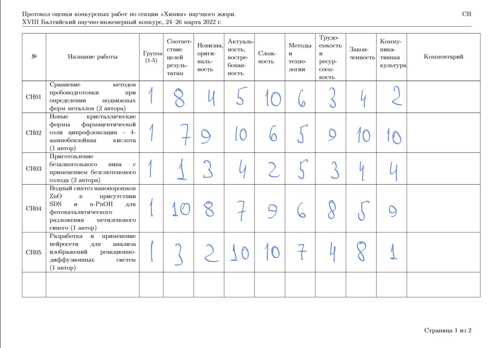
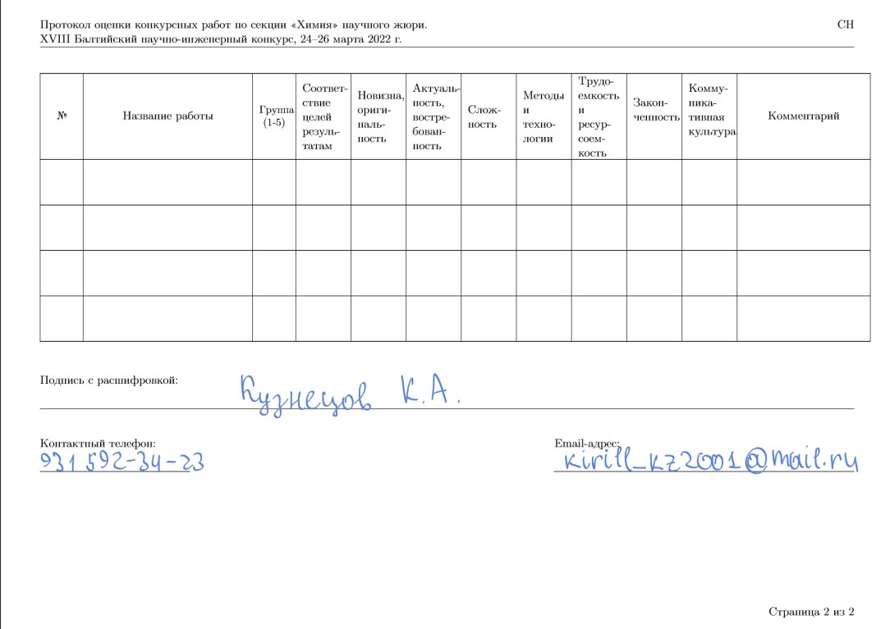
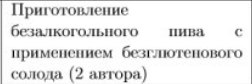
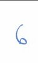

# protocol_detection_bot
## Мотивация

Во время проведения Балтийского конкурса все организаторы столкнулись с одной проблемой - необходимо **перенести** все оценки жюри, которые они проставляют на специальных бланках, в электронный формат.   
 Естественно, это все делается **руками**, поэтому процесс вбивания таких оценок **затягивается** порой до самого утра. Хотелось построить модельку, которая будет распознавать, к какому проекту была поставлена какая оценка по отсканированному бланку и заносить их в электронную форму.

Формат бланков следующий

## Задачи

* Парсинг бланков на отдельные ячейки и хранение данных(Python + API ?)

               

* Распознования текста (в одной ячейки, так и в комбинации)
* Способ запроса готового продукта (Python, pytelegrambotapi) 

